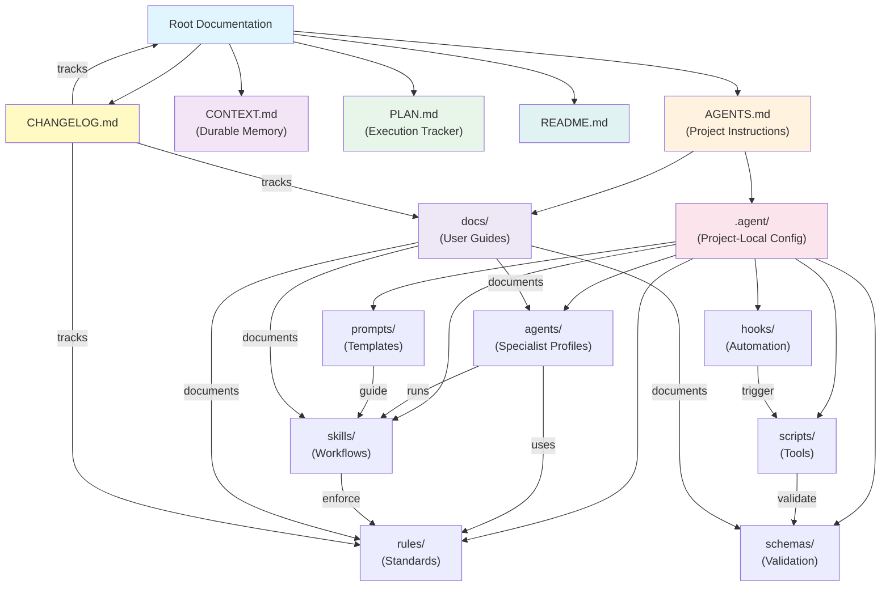
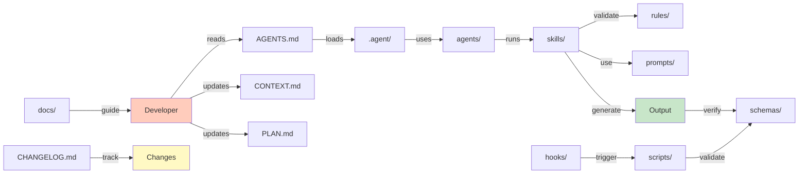

# dotagent Architecture Graph

**Visual representation** of how dotagent components connect and depend on each other.

**View this in Obsidian:** Open in Obsidian vault and press `Ctrl+G` (or Cmd+G) to see interactive graph of all internal links below.

---

## System Architecture



---

## Root Level (Project Memory)


## Component Connections

### Root Level (Project Memory)
- **[AGENTS.md](AGENTS.md)** — Project instructions, defines how Agent should behave
  - Reads: [CONTEXT.md](CONTEXT.md), [PLAN.md](PLAN.md)
  - Loads: [.agent](agents/) structure
  - Links to: [docs/](docs/README.md), [rules/](rules/), [rules/code-quality.md](rules/code-quality.md)
  - Updated when: Project workflow changes, new specialist agents needed

- **[CONTEXT.md](CONTEXT.md)** — Durable project memory across sessions
  - Referenced by: [AGENTS.md](AGENTS.md), [PLAN.md](PLAN.md)
  - Links to: Architecture decisions, constraints, risks
  - Related to: [Architecture.md](#architecture), design documents
  - Updated when: Major decisions made, context changes

- **[PLAN.md](PLAN.md)** — Active execution tracker (updated every sprint)
  - References: [CONTEXT.md](CONTEXT.md), [AGENTS.md](AGENTS.md)
  - Linked from: [GitHub Actions](.github/workflows/plan-md-reminder.yml)
  - Follows: [schemas/plan.schema.json](schemas/plan.schema.json)
  - Related to: [milestone.md](#milestone), weekly sprints
  - Updated when: Weekly [PLAN.md reminder](CHANGELOG.md#staying-updated)

- **[README.md](README.md)** — Project overview and getting started
  - Links to: [docs/quick-start.md](docs/quick-start.md), [docs/migration-guide.md](docs/migration-guide.md), [docs/](docs/README.md)
  - References: Installation via [dotagent/scripts/](scripts/), [agents/default-agent.md](agents/default-agent.md)
  - Audience: New users and integrators
  - Updated when: Major feature releases

- **[CHANGELOG.md](CHANGELOG.md)** — Version history and what changed
  - Tracks: Changes to [rules/](rules/), [docs/](docs/README.md), [agents/](agents/), [skills/](skills/)
  - References: [docs/migration-guide.md](docs/migration-guide.md) for version upgrades
  - Links to: [GitHub Actions](.github/workflows/plan-md-reminder.yml)
  - Updated when: New version released, major changes made
  - Follows: [CHANGELOG format](#how-to-contribute)

### Configuration Layer (`.agent/`)

#### [agents/](agents/) — Specialist Profiles
Current agents:
- [default-agent.md](agents/default-agent.md) — Default Agent behavior (reads [AGENTS.md](AGENTS.md))
- [code-reviewer.md](agents/code-reviewer.md) — Code review specialist (uses [rules/code-quality.md](rules/code-quality.md))
- [backend-engineer.md](agents/backend-engineer.md) — Backend implementation and service design focus (uses [rules/code-quality.md](rules/code-quality.md), [rules/security.md](rules/security.md), [rules/error-handling.md](rules/error-handling.md))
- [security-reviewer.md](agents/security-reviewer.md) — Security focus (uses [rules/security.md](rules/security.md))
- [performance-reviewer.md](agents/performance-reviewer.md) — Performance focus (uses [rules/code-quality.md](rules/code-quality.md))
- [doc-reviewer.md](agents/doc-reviewer.md) — Documentation focus (validates [docs/](docs/README.md))
- [frontend-designer.md](agents/frontend-designer.md) — Frontend focus (uses [rules/frontend.md](rules/frontend.md))

**Uses**: [rules/](rules/) for project standards → [rule-hierarchy.md](docs/rule-hierarchy.md)  
**Runs**: [skills/](skills/) for workflows  
**Linked to**: [docs/using-skills.md](docs/using-skills.md)  
**Validated by**: [schemas/](schemas/) output schemas

#### [rules/](rules/) — Engineering Standards
Current rules:
- [code-quality.md](rules/code-quality.md) — Code standards (used by [agents/code-reviewer.md](agents/code-reviewer.md))
- [testing.md](rules/testing.md) — Testing requirements (enforced by [skills/test-writer.md](skills/test-writer/SKILL.md), [skills/tdd/](skills/tdd/SKILL.md))
- [security.md](rules/security.md) — Security practices (enforced by [agents/security-reviewer.md](agents/security-reviewer.md))
- [error-handling.md](rules/error-handling.md) — Error handling patterns (documented in [docs/](docs/README.md))
- [frontend.md](rules/frontend.md) — Frontend standards (used by [agents/frontend-designer.md](agents/frontend-designer.md))
- [knowledge-graphs.md](rules/knowledge-graphs.md) — Knowledge network standards (documents [GRAPH.md](GRAPH.md) approach)

**Enforced by**: [skills/](skills/) during execution → referenced in [docs/using-skills.md](docs/using-skills.md)  
**Organized by**: [rule-hierarchy.md](docs/rule-hierarchy.md)  
**Tracked in**: [CHANGELOG.md](CHANGELOG.md#added)  
**Validated by**: [schemas/](schemas/) output

#### [skills/](skills/) — Reusable Workflows
Current skills:
- [setupdotagent/SKILL.md](skills/setupdotagent/SKILL.md) — Bootstrap new project (uses [scripts/install-dotagent.ps1](scripts/install-dotagent.ps1))
- [tdd/SKILL.md](skills/tdd/SKILL.md) — Test-driven development (enforces [rules/testing.md](rules/testing.md))
- [debug-fix/SKILL.md](skills/debug-fix/SKILL.md) — Debugging workflow (uses [rules/error-handling.md](rules/error-handling.md))
- [explain/SKILL.md](skills/explain/SKILL.md) — Code explanation (references [knowledge-graphs.md](rules/knowledge-graphs.md))
- [refactor/SKILL.md](skills/refactor/SKILL.md) — Code refactoring (enforces [rules/code-quality.md](rules/code-quality.md))
- [test-writer/SKILL.md](skills/test-writer/SKILL.md) — Test generation (enforces [rules/testing.md](rules/testing.md))

**Uses**: [rules/](rules/) for validation  
**Triggered by**: [agents/](agents/) and [PLAN.md](PLAN.md)  
**Uses**: [prompts/](prompts/) templates  
**Documented in**: [docs/using-skills.md](docs/using-skills.md)  
**Output validated by**: [schemas/](schemas/)

#### [hooks/](hooks/) — Automation Scripts  
Current hooks (documented in [hooks/README.md](hooks/README.md)):
- session-start.ps1 — Initialize session (validates [AGENTS.md](AGENTS.md))
- pre-bash-context.ps1 — Pre-execution setup (reads [CONTEXT.md](CONTEXT.md))
- doc-presence.ps1 — Verify docs exist (checks [docs/](docs/README.md))
- path-guard.ps1 — Validate paths (finds [.agent/](agents/))
- graph-staleness.ps1 — Check [GRAPH.md](GRAPH.md) freshness

**Trigger**: [scripts/](scripts/) execution  
**Validate**: Output against [schemas/](schemas/)  
**Documented in**: [hooks/README.md](hooks/README.md)  
**Part of**: Overall automation flow

#### [scripts/](scripts/) — Automation Tools
Current scripts (documented in [scripts/README.md](scripts/README.md)):
- [install-dotagent.ps1](scripts/install-dotagent.ps1) — Bootstrap installation (sets up [agents/default-agent.md](agents/default-agent.md))
- [init-project-docs.ps1](scripts/init-project-docs.ps1) — Initialize documentation (creates [CONTEXT.md](CONTEXT.md), [PLAN.md](PLAN.md))
- [health-check.ps1](.agent/scripts/health-check.ps1) — Validate setup (checks [.agent/](agents/) exists)
- [validate-links.ps1](.agent/scripts/validate-links.ps1) — Check markdown links (validates [docs/](docs/README.md))
- [dotagent.ps1](scripts/dotagent.ps1) — Main orchestrator

**Validate using**: [schemas/](schemas/)  
**Documented in**: [scripts/README.md](scripts/README.md)  
**Called by**: [hooks/](hooks/) and manual execution

#### [prompts/](prompts/) — Execution Templates
Current prompts:
- [task.md](prompts/task.md) — Task execution template (follows [PLAN.md](PLAN.md) format)
- [review.md](prompts/review.md) — Review template (output validated by [schemas/review-output.schema.json](schemas/review-output.schema.json))

**Used by**: [dotagent.ps1](scripts/dotagent.ps1) for single-job flows and staged `run` workflows

**Guide**: [skills/](skills/) execution  
**Referenced in**: [docs/using-skills.md](docs/using-skills.md)  
**Output format**: Defined by [schemas/](schemas/)

#### [schemas/](schemas/) — Validation & Documentation
Current schemas (documented in [schemas/README.md](schemas/README.md)):
- [job.schema.json](schemas/job.schema.json) — Formal persisted job contract
- [workflow.schema.json](schemas/workflow.schema.json) — Workflow DAG contract
- [requirement.schema.json](schemas/requirement.schema.json) — Template for Requirement.md
- [architecture.schema.json](schemas/architecture.schema.json) — Template for Architecture.md
- [context.schema.json](schemas/context.schema.json) — Template for [CONTEXT.md](CONTEXT.md)
- [plan.schema.json](schemas/plan.schema.json) — Template for [PLAN.md](PLAN.md)
- [review-output.schema.json](schemas/review-output.schema.json) — Validates [review.md](prompts/review.md) output
- [task-output.schema.json](schemas/task-output.schema.json) — Validates [task.md](prompts/task.md) output

**Validate**: [scripts/](scripts/) output  
**Used by**: Root documentation  
**Documented in**: [schemas/README.md](schemas/README.md)  
**Referenced in**: [Starter Templates](docs/starter-templates.md)

**Validate**: [scripts/](scripts/) and hook outputs  
**Used by**: Root documentation  
**Documented in**: [schemas/README.md](schemas/README.md)

### Documentation Layer (`docs/`)

Entry points for different audiences:
- [index.md](docs/index.md) — Navigation hub (by role, question, time)
- [quick-start.md](docs/quick-start.md) — 5-minute setup (new projects)
- [migration-guide.md](docs/migration-guide.md) — 5-phase adoption (existing projects)
- [faq.md](docs/faq.md) — 30+ common questions
- [troubleshooting.md](docs/troubleshooting.md) — Solutions for 20+ issues
- [customize-for-your-stack.md](docs/customize-for-your-stack.md) — Language-specific setup
- [rule-hierarchy.md](docs/rule-hierarchy.md) — Rule precedence and conflicts
- [using-skills.md](docs/using-skills.md) — Walkthrough of all 6 skills
- [github-actions-integration.md](docs/github-actions-integration.md) — CI/CD workflows
- [case-study.md](docs/case-study.md) — Real team metrics and validation
- [obsidian-integration.md](docs/obsidian-integration.md) — Obsidian vault setup
- [starter-templates.md](docs/starter-templates.md) — Copy-paste document templates
- [README.md](docs/README.md) — Documentation orientation guide

**Linked from**: Root files and [AGENTS.md](AGENTS.md)  
**Updated when**: New features, guides, or breaking changes

## Data Flow



## Quick Navigation by Component

### Want to add a new rule?
1. Create `rules/your-rule.md`
2. Update `rules/README.md` with new rule
3. Add to [rule-hierarchy.md](docs/rule-hierarchy.md)
4. Update [CHANGELOG.md](CHANGELOG.md)

### Want to create a new skill?
1. Create `skills/your-skill/SKILL.md`
2. Update `skills/README.md` with new skill
3. Document in [using-skills.md](docs/using-skills.md)
4. Reference in [AGENTS.md](AGENTS.md)

### Want to add documentation?
1. Create `docs/your-guide.md`
2. Update [docs/README.md](docs/README.md) with new guide
3. Add to [docs/index.md](docs/index.md) for navigation
4. Update [CHANGELOG.md](CHANGELOG.md)

### Want to add a GitHub Action?
1. Create `.github/workflows/your-action.yml`
2. Document in [github-actions-integration.md](docs/github-actions-integration.md)
3. Link from [AGENTS.md](AGENTS.md)

### Want to update version history?
1. Update [CHANGELOG.md](CHANGELOG.md) with your change
2. Include section: Added, Changed, Fixed, Deprecated, Removed, Breaking Changes
3. Tag and release through GitHub

## Network Dependencies

### Critical Path (must exist)
```
AGENTS.md → .agent/ → agents/ → rules/
AGENTS.md → CONTEXT.md, PLAN.md
AGENTS.md → docs/README.md
```

### Optional but Recommended
```
hooks/ → scripts/ → schemas/
skills/ → prompts/ → rules/
CHANGELOG.md → docs/ updates
```

### External Integrations
```
GitHub Actions (.github/workflows/) → PLAN.md reminder
Obsidian (optional) → docs/ with backlinks
graphify (optional) → generates GRAPH_REPORT.md
Jira, Confluence (optional) → referenced in rules/
```

## Visualization Tips

### For Obsidian Users (Native Graph Visualization)
This file uses **internal markdown links** which Obsidian's Graph plugin automatically visualizes.

**View the interactive graph:**
1. Open this file (`GRAPH.md`) in your Obsidian vault
2. Press `Ctrl+G` (or `Cmd+G` on Mac) to see the **Local Graph View**
3. All internal links below will render as an interactive network graph

**What you'll see:**
- **Nodes** — Files and components (colored by type)
  - Cyan: Root docs
  - Orange: AGENTS.md references
  - Purple: CONTEXT.md references
  - Green: PLAN.md references
  - Pink: .agent/ files
  - Blue: docs/ guides
- **Edges** — Links showing dependencies and relationships
- **Breadcrumbs** — Navigation path in upper left
- **Search/Filter** — Find specific components by name

**Tips:**
1. Click any node to focus on it and its connections
2. Double-click a node to open that file
3. Use Ctrl+F to search within the graph
4. Drag to pan, scroll to zoom
5. Right-click nodes for options (open, reveal in sidebar, etc.)

**See the full vault graph:**
- Press `Ctrl+G` again from any file to see the **Vault Graph** (all interlinked files)
- Shows how GRAPH.md, AGENTS.md, docs/, and other components connect overall

---

### For GitHub Users
1. Mermaid diagrams render automatically in markdown
2. Follow links to navigate components
3. Use [docs/index.md](docs/index.md) for guided navigation

### For graphify Users
If you have graphify installed:
1. Run: `graphify --repo . --output graphify-out`
2. View: `graphify-out/GRAPH_REPORT.md`
3. See: Detailed code dependency graph
4. Compare: With this architectural graph

## Component Statistics

| Category | Count | Key Files |
|----------|-------|-----------|
| Root Docs | 5 | AGENTS, CONTEXT, PLAN, README, CHANGELOG |
| Agents | 7 | default, code-reviewer, backend, security, performance, doc, frontend |
| Rules | 6 | code-quality, testing, security, error-handling, frontend, knowledge-graphs |
| Skills | 6 | setupdotagent, tdd, debug-fix, explain, refactor, test-writer |
| Hooks | 5 | session-start, pre-bash-context, doc-presence, path-guard, graph-staleness |
| Scripts | 5 | install, init, health-check, validate-links, dotagent |
| Prompts | 2 | task, review |
| Schemas | 8 | job, workflow, requirement, architecture, context, plan, review-output, task-output |
| Docs | 13 | quick-start, index, faq, troubleshooting, migration, customize, rule-hierarchy, skills, github-actions, case-study, obsidian, templates, readme |
| Workflows | 1 | plan-md-reminder |
| **Total** | **55** | Components and files |

---

## See Also

- [AGENTS.md](AGENTS.md) — Project setup and workflow
- [Obsidian Integration](docs/obsidian-integration.md) — How to view this graph in Obsidian
- [docs/index.md](docs/index.md) — Navigation hub
- [CHANGELOG.md](CHANGELOG.md) — What changed and when


