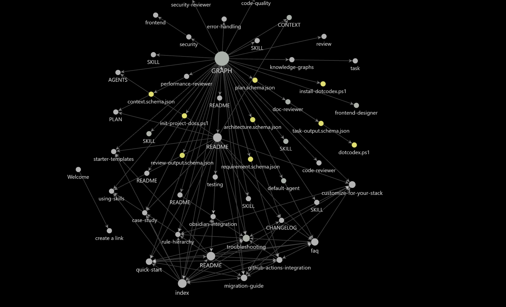

# dotcodex

`dotcodex` is a reusable project bootstrap for Codex-driven software development.

Use it when you want Codex to work the same way across many repos: read the right docs first, follow project rules, keep planning artifacts, and support repeatable task and review workflows.

## What It Is

`dotcodex` is a source pack.

It is not the same thing as your global `C:\Users\<you>\.codex` folder.

- global `C:\Users\<you>\.codex`
  - machine-level Codex home
  - personal defaults and installed tools
- project `your-project\.codex`
  - project-specific hooks, agents, rules, prompts, schemas, scripts, and skills
- project `your-project\dotcodex`
  - the source pack you keep in the repo and install from

Codex should use the project-local `AGENTS.md` and `your-project\.codex\...` files for project behavior. The `dotcodex/` folder is the source that installs those files into the active project layout.

## Prerequisites

- Windows with PowerShell
- a working local Codex CLI installation available as `codex` or `codex.cmd`
- a repo where you want project-local Codex behavior

Optional:

- `graphify` for graph-based repo summaries
- Obsidian for linked markdown navigation (see [Obsidian Integration Guide](docs/obsidian-integration.md))
- GitHub, GitLab, Azure DevOps, Jira, Confluence, Zephyr, or similar team systems

`dotcodex` does not require Jira, Confluence, or Zephyr to work. Those systems are integration targets around the workflow, not hard dependencies of the pack.

## Getting Started

**Not sure where to begin?** → [Go to Navigation Hub](docs/index.md) (1 min to find the right guide for you)

**Starting a new project?** → [Quick Start Guide](docs/quick-start.md) (10 min setup + first task)

**Adopting dotcodex in existing project?** → [Migration Guide](docs/migration-guide.md) (60 min adaptation plan)

**Want to see a real example?** → [Case Study](docs/case-study.md) (How team "Acme Analytics" used dotcodex)

---

## Complete Documentation

| Guide | Best For | Time |
|-------|----------|------|
| [Navigation Hub](docs/index.md) | Finding the right doc | 5 min |
| [Quick Start](docs/quick-start.md) | New projects | 10 min |
| [Migration Guide](docs/migration-guide.md) | Existing projects | 60 min |
| [FAQ](docs/faq.md) | Common questions | 15 min |
| [Customize for Your Stack](docs/customize-for-your-stack.md) | Language-specific rules | 30 min |
| [Rule Hierarchy](docs/rule-hierarchy.md) | Understanding rule conflicts | 20 min |
| [Using Skills](docs/using-skills.md) | TDD, debugging, testing | 30 min |
| [Troubleshooting](docs/troubleshooting.md) | Solving problems | As needed |
| [Obsidian Integration](docs/obsidian-integration.md) | Using Obsidian for docs | 25 min |
| [GitHub Actions Integration](docs/github-actions-integration.md) | CI/CD validation | 30 min |
| [Starter Templates](docs/starter-templates.md) | Copy-paste doc templates | 10 min |
| [Case Study](docs/case-study.md) | Learning by example | 15 min |

**[→ Start with Navigation Hub if you're lost](docs/index.md)**

---

## Staying Updated

**What Changed?** → [CHANGELOG.md](CHANGELOG.md) — Version history, new docs, breaking changes

**Component Graph** → [GRAPH.md](GRAPH.md) — Visual architecture showing connections (works with Obsidian graph view)


*Interactive graph view in Obsidian showing dotcodex component connections. Open GRAPH.md in Obsidian and press Ctrl+G to see this live — click nodes to navigate, drag to pan, scroll to zoom.*

**Weekly Reminder** → GitHub Action runs every Monday reminding teams to update PLAN.md

---

## Start A New Project

This is the normal setup flow for a real project.

Example project: `novax`

```text
novax/
├── src/
├── tests/
└── dotcodex/
```

1. Put `dotcodex/` in the project root.

If you keep this pack as a separate repo, clone or copy it into the project:

```powershell
git clone <your-dotcodex-repo> .\dotcodex
```

2. From the project root, install the active project files:

```powershell
powershell -ExecutionPolicy Bypass -File .\dotcodex\scripts\install-dotcodex.ps1 -ProjectRoot .
```

3. After install, the project should look like this:

```text
novax/
├── AGENTS.md
├── CONTEXT.md
├── PLAN.md
├── dotcodex/
├── .codex/
│   ├── hooks.json
│   ├── agents/
│   ├── hooks/
│   ├── prompts/
│   ├── rules/
│   ├── schemas/
│   ├── scripts/
│   └── skills/
├── src/
└── tests/
```

4. Create the required root design docs:

```powershell
powershell -ExecutionPolicy Bypass -File .\.codex\scripts\init-project-docs.ps1 -ProjectRoot .
```

This creates:

- `Requirement.md`
- `Architecture.md`
- `HLD.md`
- `DD.md`
- `milestone.md`

5. Initialize the local runtime:

```powershell
powershell -ExecutionPolicy Bypass -File .\.codex\scripts\dotcodex.ps1 setup
```

At that point Codex can treat `novax` as a project with stable local instructions and working memory.

## What The Installer Does

The installer copies:

- `dotcodex/AGENTS.md` -> `./AGENTS.md`
- `dotcodex/CONTEXT.md` -> `./CONTEXT.md`
- `dotcodex/PLAN.md` -> `./PLAN.md`
- `dotcodex/hooks.json` -> `./.codex/hooks.json`
- `dotcodex/agents/*` -> `./.codex/agents/*`
- `dotcodex/hooks/*` -> `./.codex/hooks/*`
- `dotcodex/prompts/*` -> `./.codex/prompts/*`
- `dotcodex/rules/*` -> `./.codex/rules/*`
- `dotcodex/schemas/*` -> `./.codex/schemas/*`
- `dotcodex/scripts/*` -> `./.codex/scripts/*`
- `dotcodex/skills/*` -> `./.codex/skills/*`

Default behavior:

- installs missing files
- skips files that already exist

To overwrite installed files during an upgrade:

```powershell
powershell -ExecutionPolicy Bypass -File .\dotcodex\scripts\install-dotcodex.ps1 -ProjectRoot . -Force
```

## Day-To-Day Workflow

Once installed into `novax`, the working loop is:

1. Fill in the root docs.
2. Ask Codex to read `AGENTS.md`, `CONTEXT.md`, `PLAN.md`, and the design docs.
3. Work one milestone at a time.
4. Validate after each milestone.
5. Update `PLAN.md` and `CONTEXT.md` as decisions change.

Typical runtime commands:

Prepare a task:

```powershell
powershell -ExecutionPolicy Bypass -File .\.codex\scripts\dotcodex.ps1 task "Implement authentication retry handling"
```

Execute a task through the local Codex CLI:

```powershell
powershell -ExecutionPolicy Bypass -File .\.codex\scripts\dotcodex.ps1 task "Implement authentication retry handling" -Execute
```

Prepare a review:

```powershell
powershell -ExecutionPolicy Bypass -File .\.codex\scripts\dotcodex.ps1 review -Target "current branch vs main"
```

Check job status:

```powershell
powershell -ExecutionPolicy Bypass -File .\.codex\scripts\dotcodex.ps1 status
```

Inspect a saved result:

```powershell
powershell -ExecutionPolicy Bypass -File .\.codex\scripts\dotcodex.ps1 result -Id <job-id>
```

Local job state is stored under `.dotcodex-state/` in the project root.

## When to Use Each Agent

- **default-agent** (everyday work)
  - Use for implementation, milestone completion, and architecture-aligned development
  - Reads root docs first, applies project rules, updates CONTEXT.md and PLAN.md
  
- **code-reviewer** (pre-merge validation)
  - Use for PRs, code changes, and behavioral regressions
  - Checks correctness, missing validation, missing tests, risky assumptions

- **security-reviewer** (security audit)
  - Use when implementing auth, data handling, input processing, or integrations
  - Focuses on exploitability, attack paths, secrets handling, least privilege

- **performance-reviewer** (post-merge optimization)
  - Use after a feature is merged to identify measurable bottlenecks
  - Looks for repeated work, blocking I/O, N+1 patterns, large payload movement

- **doc-reviewer** (documentation accuracy)
  - Use to verify commands, file paths, assumptions in documentation
  - Flags stale or contradictory guidance

- **frontend-designer** (UI/UX work)
  - Use when building user interfaces or design systems
  - Ensures deliberate interfaces, accessibility, responsiveness, design system consistency

## When to Use Each Skill

- **setupdotcodex**
  - Run after installing dotcodex to document build, test, lint commands and refine project rules
  
- **tdd** (test-driven development)
  - Use to drive changes through small failing tests and minimum implementation
  
- **debug-fix** (defect investigation)
  - Use when a bug is reported; reproduce → trace root cause → fix → test
  
- **refactor** (structural improvement)
  - Use to improve code structure when behavior must remain stable
  - Establish safety net with tests first
  
- **explain** (code understanding)
  - Use to document existing code before making changes
  - Explains purpose, data flow, non-obvious behavior, modification risks
  
## When to Use Each Skill

- **setupdotcodex**
  - Run after installing dotcodex to document build, test, lint commands and refine project rules
  
- **tdd** (test-driven development)
  - Use to drive changes through small failing tests and minimum implementation
  
- **debug-fix** (defect investigation)
  - Use when a bug is reported; reproduce → trace root cause → fix → test
  
- **refactor** (structural improvement)
  - Use to improve code structure when behavior must remain stable
  - Establish safety net with tests first
  
- **explain** (code understanding)
  - Use to document existing code before making changes
  - Explains purpose, data flow, non-obvious behavior, modification risks
  
- **test-writer** (test coverage)
  - Use to add focused tests for new or changed behavior
  - Covers happy path, edge cases, error paths, integration boundaries

## Customize Rules for Your Stack

dotcodex rules are generic by design. Learn how to add stack-specific rules without modifying dotcodex itself: [Customize for Your Stack](docs/customize-for-your-stack.md)

Examples:
- Python projects: add pytest, type hints, virtual env rules
- JavaScript/TypeScript: add ESLint, TypeScript strictness, Prettier rules
- Java projects: add Maven/Gradle, spotbugs, JUnit 5 rules
- Full-stack: add API contract, deployment pipeline rules

## Understand Rule Precedence

When generic, stack-specific, and domain rules exist, which one applies? See [Rule Hierarchy & Conflicts](docs/rule-hierarchy.md) for:
- How rules at different levels interact
- Resolving conflicts between rules
- Creating complementary (not conflicting) rules across teams

## Troubleshooting

Having issues? Check [Troubleshooting Guide](docs/troubleshooting.md) for:
- Installation & setup problems (AGENTS.md not found, scripts won't run, etc.)
- Rules not being followed
- Hooks not firing
- Context/documentation issues
- Multi-team governance

## Required Project Docs

Before substantial implementation, create:

- `Requirement.md`
- `Architecture.md`
- `HLD.md`
- `DD.md`
- `milestone.md`

Fastest path:

```powershell
powershell -ExecutionPolicy Bypass -File .\.codex\scripts\init-project-docs.ps1 -ProjectRoot .
```

Recommended minimum contents:

- `Requirement.md`
  - functional requirements
  - non-functional requirements
  - data definitions
  - edge cases
- `Architecture.md`
  - system overview
  - architecture style
  - technology choices
  - interfaces
- `HLD.md`
  - modules
  - responsibilities
  - dependencies
  - integration points
- `DD.md`
  - classes
  - algorithms
  - data structures
  - complexity
  - error handling
- `milestone.md`
  - milestone objective
  - files to modify
  - verification steps
  - exit criteria

## Example: `novax`

Suppose `novax` is a backend service plus web frontend.

After installing `dotcodex`, your first session should look like this:

1. Create `Requirement.md` describing the login flow, API behavior, latency goals, and error cases.
2. Create or refine `Architecture.md` describing frontend, API, data store, and deployment shape.
3. Create or refine `HLD.md` for module boundaries such as auth, billing, notifications, and UI.
4. Create or refine `DD.md` for concrete classes, APIs, and failure handling.
5. Create or refine `milestone.md` with milestones such as bootstrap, auth, payments, dashboard, and deploy.
6. Ask Codex to implement one milestone at a time using the installed `AGENTS.md` and `.codex/` rules.

That gives you a repeatable operating model instead of starting each repo from scratch.

## Merge Request And Pull Request Workflow

`dotcodex` does not replace Git hosting workflow. It helps Codex produce and review the work around that workflow.

Suggested branch flow:

1. Create a feature branch for a milestone.
2. Use `dotcodex` task prompts to implement the milestone.
3. Run local validation.
4. Use `dotcodex` review prompts against `branch vs main`.
5. Open a PR or MR in GitHub, GitLab, or Azure DevOps.
6. Copy the review summary or findings into the PR or MR description if useful.
7. Update `PLAN.md` and `milestone.md` after merge.

Suggested review targets:

- `current branch vs main`
- `MR !42`
- `PR #18`
- `authentication module refactor`

The runtime itself is local and generic. Your actual PR or MR still lives in your git hosting platform.

## Jira, Confluence, Zephyr, Wikis, And Other Systems

Yes, `dotcodex` can be used alongside those systems.

Recommended pattern:

- Jira
  - track epics, stories, and sprint work
  - mirror ticket IDs in `PLAN.md` and branch names
- Confluence or internal wiki
  - keep larger architecture and ADR-style documents there
  - link the important pages from `CONTEXT.md` or `Architecture.md`
- Zephyr or test management tools
  - track formal test cases and release validation
  - link test plans from `milestone.md`
- GitHub/GitLab/Azure DevOps
  - keep the actual code review and merge workflow there

Practical rule:

- keep the project-local markdown docs as Codex-readable execution context
- link out to Jira, Confluence, Zephyr, and wiki systems when needed
- do not force Codex to depend on a remote tool just to understand the local repo

If you later add connectors, MCP tools, or repo-specific automation, `dotcodex` can sit on top of them. The local docs remain the stable fallback.

## Global `.codex` vs Project `.codex`

Do not depend on `C:\Users\<you>\.codex` for project-specific behavior.

Use this split:

- global `.codex`
  - personal machine defaults
  - shared reusable tools
- project `.codex`
  - the active rules and runtime for that repo
- `dotcodex/`
  - the source template that installs into the project `.codex`

That model makes the project portable for any developer who clones the repo.

## Local Runtime

`.codex/scripts/dotcodex.ps1` is a small local runtime for prompt packaging and job tracking.

It can:

- prepare task prompts
- prepare review prompts
- track local job records
- optionally execute prepared prompts through the local Codex CLI

Notes:

- `-Execute` requires a working local Codex CLI and authentication state
- prepare-only mode is the safe default
- `cancel` updates local job state only; it does not terminate an already running external Codex process

## Optional Graph And Wiki Support

If you use `graphify`:

1. install `graphify`
2. run `graphify codex install`
3. build graph output for the project
4. let Codex start from `graphify-out/GRAPH_REPORT.md` when available

If you use Obsidian:

- keep root docs linked together
- use Graph view for architecture navigation

Both integrations are optional.

## Bootstrap Commands

For a brand-new project:

```powershell
powershell -ExecutionPolicy Bypass -File .\dotcodex\scripts\install-dotcodex.ps1 -ProjectRoot .
powershell -ExecutionPolicy Bypass -File .\.codex\scripts\init-project-docs.ps1 -ProjectRoot .
powershell -ExecutionPolicy Bypass -File .\.codex\scripts\dotcodex.ps1 setup
```

That is the shortest path from a repo with a `dotcodex/` folder to a repo that Codex can use consistently.

## Notes

- `dotcodex` is intended to be reused across many repos
- the installed project files are what Codex should read and follow
- the `dotcodex/` folder is the source pack and installer source
